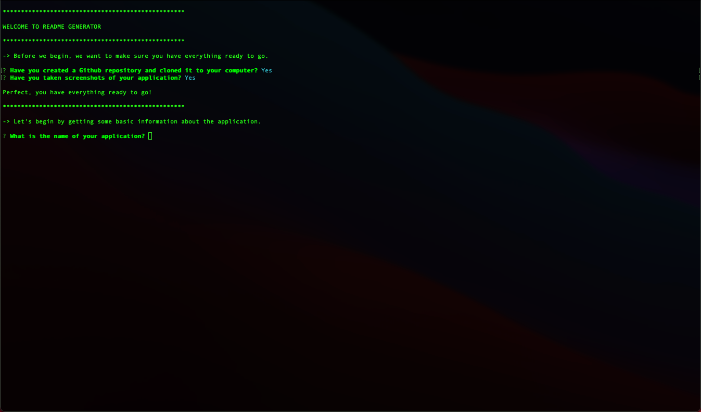
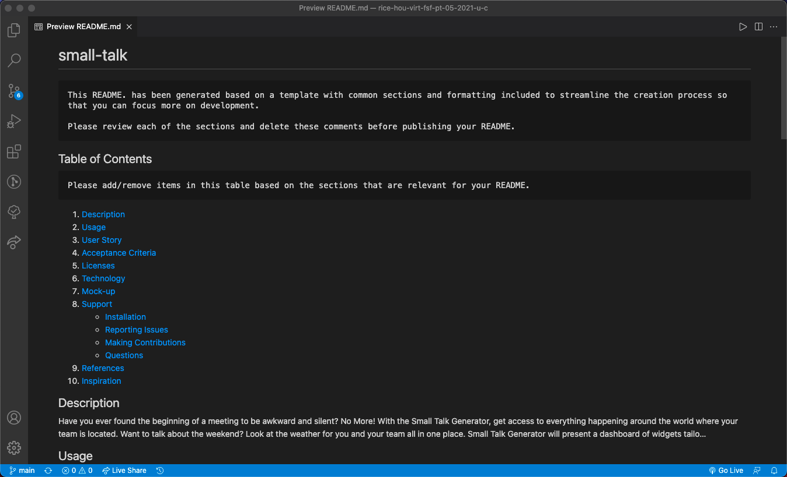

# readme-generator

## Table of Contents

1. [Description](#description)
1. [Usage](#usage)
1. [User Story](#user-story)
1. [Acceptance Criteria](#acceptance-criteria)
1. [Licenses](#licenses)
1. [Technology](#technology)
1. [Mock-up](#mock-up)
1. [Support](#support)
   - [Installation](#installation)
   - [Questions](#questions)
1. [References](#references)

## Description
When creating an open source project on GitHub, it’s important to have a high-quality README for the app. This should include what the app is for, how to use the app, how to install it, how to report issues, and how to make contributions.

## Usage
You can access the app here: [https://github.com/avidrunner87/readme-generator](https://github.com/avidrunner87/readme-generator).

## User Story
>**AS A(N)** developer<br>I **WANT** a README generator<br>**SO THAT** I can quickly create a professional README for a new project


## Acceptance Criteria
**GIVEN** a command-line application that accepts user input

>**WHEN** I am prompted for information about my application repository<br>
**THEN** a high-quality, professional README is generated with the title of my project and sections entitled Description, Table of Contents, Installation, Usage, License, Contributing, Tests, and Questions

>**WHEN** I enter my project title<br>
**THEN** this is displayed as the title of the README

>**WHEN** I enter a description, installation instructions, usage information, contribution guidelines, and test instructions<br>
**THEN** this information is added to the sections of the README entitled Description, Installation, Usage, Contributing, and Tests

>**WHEN** I choose a license for my application from a list of options<br>
**THEN** a badge for that license is added near the top of the README and a notice is added to the section of the README entitled License that explains which license the application is covered under

>**WHEN** I enter my GitHub username<br>
**THEN** this is added to the section of the README entitled Questions, with a link to my GitHub profile

>**WHEN** I enter my email address<br>
**THEN** this is added to the section of the README entitled Questions, with instructions on how to reach me with additional questions

>**WHEN** I click on the links in the Table of Contents<br>
**THEN** I am taken to the corresponding section of the README

## Licenses
[](https://github.com/avidrunner87/readme-generator/blob/main/LICENSE.md)

## Technology


## Mock-up
The following picture shows the website appearance and capabilities:

<br>



We also have a video that walks you through the entire application:

[Access Video](https://github.com/avidrunner87/readme-generator/blob/main/assets/images/screenshots/walkthrough.mp4)

## Support
### Installation
To fork this code to further improve the website, please follow these directions:

1. In Github fork the repository.
1. Clone the repository to your local computer.

_This assumes that you have setup your own SSH keys to connect with Github._

1. Before running the readme-generator, please ensure all the necessary node modules are installed:

```
npm install
```

### Questions
If you have any questions please reach out to me via [Github](https://github.com/avidrunner87) or via [email](mailto:andrew.ronchetto@me.com).

## References
[Inquirer.js](https://github.com/SBoudrias/Inquirer.js#readme)
